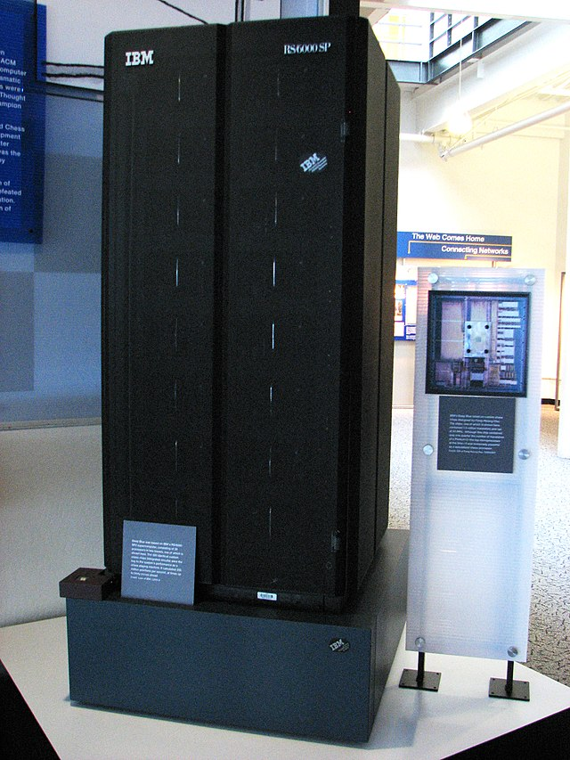

# 1. ORIËNTEREN - Introductie en kernbegrippen
---
**Datum:** 2025-08-18
**Laatste wijziging:** 2025-08-19

---
**Leerdoel**  
In deze module raak je vertrouwd met het begrip AI en de kernbegrippen rondom AI.  

---
**Inhoud**
- [Inleiding](#inleiding)
- [Definitie van AI](#definitie-van-ai)
- [De ontwikkeling van AI en de drijvende krachten](#de-ontwikkeling-van-ai-en-de-drijvende-krachten)
- [Conclusie](#conclusie)

---
### Inleiding
In de volgende module Verkennen, gaan we een aantal AI-tools van deze tijd verkennen. Hoewel het niet noodzakelijk is om deze module te doorlopen om de de module Verkennen te begrijpen, biedt deze module waardevolle context. Het helpt je om de basisprincipes van AI te begrijpen en geeft je een fundament voor het verkennen van AI-tools in de volgende module.

### Definitie van AI

**AI... niet te beschrijven!**
Als je iets wilt begrijpen, begin je vaak met de vraag: *Wat is het?*  
Je probeert het in te kaderen, te definiëren.  

Bij artificiële intelligentie, oftewel kunstmatige intelligentie, lopen we daar meteen tegen problemen aan. Het is om meerdere redenen lastig om tot één heldere definitie te komen:  

- Het is al lastig om **menselijke intelligentie** te definiëren  
  > Psycholoog Robert J. Sternberg legt in het artikel ['What is intelligence, really? The futile search for a Holy Grail' (2024)](https://www.sciencedirect.com/science/article/abs/pii/S1041608024001614) uit waarom het zoeken naar een allesomvattende definitie van intelligentie onbegonnen werk is. Hij stelt dat onze energie beter besteed kan worden aan het onderzoeken **hoe** intelligentie wordt ingezet. Intelligent gedrag hangt namelijk niet alleen af van de persoon, maar ook van de taak en de situatie.   
  *"Velen van ons die zichzelf als intelligent beschouwen, zouden in een andere tijd waarschijnlijk het middagmaal van een prehistorisch dier zijn geweest."*, aldus Sternberg. 

- De **voorwaarden** om iets ‘intelligent’ te noemen verschuiven voortdurend.  
  > In 1997 versloeg IBM’s Deep Blue de wereldkampioen schaken Garry Kasparov — destijds een baanbrekende AI-doorbraak. Tegenwoordig zien we schaakcomputers als gewone software. Wat toen gold als AI, voldoet niet meer aan de huidige criteria.
  > 
  > *IBM's Deep Blue*

- Beleidsmakers hebben over het algemeen onvoldoende basiskennis over AI waardoor hun definities vaak **vaag, onjuist of te breed** worden geformuleerd.
  > In het artikel ['Defining Artificial Intelligence' (Weitzel, 2025)](https://papers.ssrn.com/sol3/papers.cfm?abstract_id=5154389) wordt opgemerkt dat "een kwart van de onderzochte verordeningen ook een zonnewijzer zou aanmerken als AI". Een ander derde deel bevat helemaal geen definitie, wat leidt tot onduidelijk beleid.

- **AI Washing**: Bedrijven overdrijven of zijn misleidend over het gebruik van AI in hun producten om aantrekkelijker of innovatiever over te komen dan het werkelijk is. Dit staat ook wel bekend als [AI washing](referentie/begrippenlijst.md#ai-washing). Hierdoor vervaagt de technische betekenis van AI, wordt AI zowel onder- als overhyped, verandert het in een leeg buzzword en daalt uiteindelijk het vertrouwen in echte toepassingen.
  > In september 2023 lanceerde Coca‑Cola de “Y3000”, een drankje dat volgens de marketing “co‑created with human and artificial intelligence” zou zijn. Kritiek kwam omdat Coca‑Cola nooit duidelijk maakte wat de rol van AI precies was—de bewering lijkt vooral bedoeld om de innovatiegerichte aantrekkingskracht te verhogen. Bron: [CTO Magazine](https://ctomagazine.com/what-is-ai-washing-why-it-is-a-problem/)

Geen gemakkelijke start, dat zeker. Maar toch is een duidelijke definitie nodig – of in ieder geval een poging daartoe.

Waarom? Zonder gedeeld begrip van wat AI precies is, kunnen we er niet helder over praten. En zonder die helderheid wordt het bijna onmogelijk om AI goed te reguleren. Dat kan leiden tot maatschappelijke problemen, of juist innovatie in de weg zitten.
> De [EU AI Act](referentie/begrippenlijst.md#eu-ai-act) ziet AI ruim. Daardoor vallen soms ook simpele ‘regelsystemen’ onder de wet. Afhankelijk van het risico komen er extra eisen bij. Voor jou als klant betekent dit twee dingen. Je ziet wanneer AI wordt gebruikt (bijvoorbeeld een label bij een chatbot of AI‑beeld). En krijg je een besluit dat je raakt, zoals een kredietaanvraag, dan staat erbij welke gegevens zijn gebruikt en kun je een mens om herbeoordeling vragen. Die extra zekerheid kost organisaties geld en tijd, wat soms terugkomt in de prijs of premie.

**Een poging tot een definitie**

In het artikel ['Defining Artificial Intelligence'](https://papers.ssrn.com/sol3/papers.cfm?abstract_id=5154389) van 2025 onderzoekt Weitzel bestaade definities en hun tekortkomingen. Op basis daarvan stelt hij een betere omschrijving voor, al benadrukt hij dat AI nooit volledig in één perfecte definitie te vangen is. De volgende definitie ziet hij dan ook als een verbetering ten opzichte van de definities die hij heeft geanalyseerd: 
- **Een computerprogramma** dat gebruikmaakt van 
- **machine learning-technieken** om 
- **complexe doelen** te bereiken die normaal gesproken 
- **menselijke intelligentie** vereisen.

Weitzel legt vervolgens uit dat door het woord *computerprogramma* te gebruiken, bredere woorden als *systeem* kunnen worden uitgesloten.
Weitzel erkent dat het idee dat de doelen "menselijke intelligentie" vereisen, wat vaag blijft, maar het helpt om simpele programma's uit te sluiten.  
Door te zeggen dat het om *[machine learning](referentie/begrippenlijst.md#machine-learning)* gaat, worden regelgebaseerde AI-modellen uitgesloten.
Deze regelgebaseerde AI-modellen – vaak aangeduid als symbolische AI, logisch-gebaseerde AI, top-down AI, klassieke AI of GOFAI (Good Old-Fashioned AI) – lossen problemen op met vooraf vastgelegde regels en logica. In deze gids gebruiken we de term symbolische AI voor dit paradigma.

Niet iedere expert is het eens met Weitzels definitie, omdat symbolische AI hiermee buiten de boot valt. Toch vertonen systemen die werken met een combinatie van regels, een kennisbank en een redeneermachine vaak intelligent gedrag. Een bekend voorbeeld is [*MYCIN*](referentie/begrippenlijst.md), een expertsysteem uit de jaren ’70 dat artsen ondersteunde bij diagnoses en antibiotica-adviezen. Het gebruikte zo’n 600 regels en redeneerde via [backward chaining](referentie/begrippenlijst.md#backward-chaining). Destijds gold het als AI, omdat het beslissingen nam, zijn redenering kon uitleggen en vaak net zo goed presteerde als menselijke artsen.

Machine learning-modellen daarentegen leren door patronen te herkennen in data, zonder vooraf ingestelde regels. Dit type AI wordt ook wel connectionistische, subsymbolische, bottom-up of data-gedreven AI genoemd.
In het vervolg gebruiken we de term connectionistische AI. Machine learning is de techniek binnen dit paradigma. 

Aan de andere kant zijn AI-modellen die alleen symbolische AI toepassen, tegenwoordig zeldzaam. In dat geval is het meestal een combinatie van symbolische en connectionistische AI. Deze combinatie wordt ook wel [hybride AI](referentie/begrippenlijst.md#hybride-ai) genoemd. In de praktijk werken veel systemen zo: regels en menselijk ontwerp bieden controle en uitlegbaarheid; leren uit data zorgt voor flexibiliteit en prestaties.
> AlphaGo leerde op twee manieren: eerst keek het naar heel veel partijen van sterke spelers en nam het patronen over. Daarna werd het nog beter door duizenden keren tegen zichzelf te spelen. Tijdens het rekenen verkent het razendsnel veel mogelijke zetten en kiest het de meest kansrijke vervolgen.

*De hardware achter AlphaGo, waarmee het beroemde Go-programma zijn berekeningen uitvoerde.*
In 2015 versloeg AlphaGo de Europese kampioen Fan Hui met 5–0, de eerste keer dat een programma onder wedstrijdvoorwaarden een professionele Go‑speler versloeg. AlphaGo is daarmee een duidelijk voorbeeld van [hybride AI](referentie/begrippenlijst.md#hybride-ai): het combineert wat het heeft geleerd met slim en systematisch doorrekenen.
Bron: [Mastering the game of Go with deep neural networks and tree search (Silver et al., 2016, Nature)](https://www.nature.com/articles/nature16961)

Het is dus onbegonnen werk om AI helder te definiëren. Zouden we dan op een andere, meer praktische manier naar AI kunnen kijken? 

**Mate van AI**
In de introductiecursus [*Elements of AI*](https://www.elementsofai.nl/) wordt benoemd dat je AI niet als een zelfstandig naamwoord kunt gebruiken (één AI, twee AI's) maar beter kunt spreken over "mate van AI" met aan de ene kant van het spectrum GOFAI en aan de andere kant moderne cutting-edge AI. 
  > In de jaren 1980 introduceerde de filosoof John Searle, de termen [*Weak AI*](referentie/begrippenlijst.md#weak-ai) en [*Strong AI*](referentie/begrippenlijst.md#strong-ai)
  Weak AI betekent hier niet dat AI “primitief” of “zwak” is, maar dat het alleen intelligent gedrag simuleert zonder echt bewustzijn of begrip.
  Strong AI verwijst naar het idee dat een AI in principe een echte geest of bewustzijn zou kunnen hebben.
  In de praktijk zijn deze termen verwarrend, omdat weak AI vaak ten onrechte wordt gelijkgesteld aan regelgebaseerde systemen of “simpele AI”. Ook moderne geavanceerde modellen zoals ChatGPT vallen nog steeds onder Searle’s weak AI, zolang ze geen bewustzijn hebben.
  Daarom gebruiken veel onderzoekers tegenwoordig liever de termen [narrow AI](referentie/begrippenlijst.md#narrow-ai) (AI die specifieke taken kan uitvoeren) en [general AI](referentie/begrippenlijst.md#general-ai) (AI die taken kan uitvoeren zoals een mens).

In het volgende gedeelte gaan we een aantal kernbegrippen (verder) toelichten. Dit doen we door de kernbegrippen in de tijdlijn van de ontwikkeling van AI te bespreken. Dan wordt ook duidelijker waarom definities steeds verschuiven.  

---

### De ontwikkeling van AI en de drijvende krachten 

Door de begrippen in deze ontwikkeling te plaatsen, zie je beter wat ze betekenen, hoe ze zich tot elkaar verhouden en waarom sommige ideeën steeds opnieuw terugkomen. Let op: dit is geen beschrijving van de geschiedenis van AI; de focus ligt op belangrijke drijvende krachten die de ontwikkeling van AI mogelijk hebben gemaakt tot wat het vandaag de dag is. 

**1950–1970**

- **Symbolische logica**
Deze periode was de geboorte van symbolische AI door logica en redeneringen weergegeven met symbolen en formele regels. Computers konden hierdoor 'redeneren' met regels die door mensen waren ingevoerd. Grofweg gezegd: als je genoeg regels opschrijft, kan een machine intelligent gedrag vertonen.
 

- **Het idee van neurale netwerken**
In die tijd was er de wens om het menselijk brein na te bootsen. Ons brein bestaat uit miljarden neuronen (zenuwcellen) die signalen doorgeven via verbindingen (synapsen). Elk neuron "vuurt" alleen wanneer het voldoende input krijgt van andere neuronen. Dit simpele principe inspireerde onderzoekers: als je dit in een computer kon nabouwen, zou de machine misschien ook kunnen leren. Later werd dit idee [neuraal netwerk](referentie/begrippenlijst.md#neuraal-netwerk) genoemd. 
Een neuraal netwerk in de AI-context is daarom een systeem van “kunstmatige neuronen” die onderling verbonden zijn. Elke verbinding heeft een gewicht: een getal dat aangeeft hoe sterk een input meetelt. Door de gewichten aan te passen op basis van voorbeelden, kan een netwerk patronen herkennen – zoals letters, geluiden of afbeeldingen.
 

- **De (single-layer) perceptron (1958)**
  In 1958 ontwierp Frank Rosenblatt de (single-layer) [perceptron](referentie/begrippenlijst.md#perceptron), een van de eerste praktisch toepasbare [neurale netwerk](referentie/begrippenlijst.md#neuraal-netwerk)-modellen. Het bestond uit één laag artificiële neuronen en kon simpele patronen herkennen. Rosenblatt was optimistisch en voorspelde dat zulke netwerken in de toekomst zouden kunnen leren, beslissingen nemen en zelfs talen vertalen. 
   

  > **De perceptron en de eerste AI-winter**
  > 
  > Rosenblatt's perceptron leek veelbelovend, maar in 1969 publiceerden Marvin Minsky en Seymour Papert een vernietigend rapport. Ze bewezen dat perceptrons fundamentele beperkingen hadden: ze konden alleen lineair scheidbare patronen leren. Het simpele XOR-probleem (exclusieve OF) kon een perceptron niet oplossen. Dit rapport, plus de hoge kosten van computers in die tijd, leidde tot de eerste AI-winter: een periode van 10+ jaar waarin weinig geld naar AI-onderzoek ging. Het duurde tot de jaren '80 voordat neurale netwerken weer serieus werden genomen.

**1970–1980**

- **AI-winter**
Verwachtingen werden niet waargemaakt. Er brak een periode aan waarin investeringen en enthousiasme voor AI sterk afnam. Zo'n periode wordt ook wel [AI-winter](referentie/begrippenlijst.md#ai-winter) genoemd. Er waren grofweg twee ‘winters’: rond 1973 (na het Lighthill‑rapport) en later circa 1987–1993 (na de hype rond expertsystemen).

**1980–2010** 

- **Expert Systems**
Laat jaren ’70 en vooral in de jaren ’80 kwamen [expertsystemen](referentie/begrippenlijst.md#expertsysteem) op: programma’s die kennisbanken met logische regels gebruikten om beslissingen te nemen. Ze werden ingezet in bijvoorbeeld de medische wereld om diagnoses te ondersteunen. De beperkingen werden later duidelijk: systemen waren moeilijk te onderhouden en leerden niet zelf bij. 
 

- **De opkomst van Machine Learning**
  De symbolische AI liep vast op problemen zoals waarneming, leren en gezond verstand. Dit maakte duidelijk dat andere benaderingen nodig waren. Het connectionistische paradigma kwam tot bloei door een aantal doorbraken die leidden tot de heropleving van neurale netwerken en de opkomst van [machine learning](referentie/begrippenlijst.md#machine-learning). In dit paradigma worden [algoritmen](referentie/begrippenlijst.md#algoritme) gebruikt om modellen te trainen op data.

**2010–2017**

- **Doorbraak van Deep Learning**
De grote doorbraak kwam met [deep learning](referentie/begrippenlijst.md#deep-learning). Dankzij krachtige GPU’s en enorme hoeveelheden data konden veel diepere [neurale netwerken](referentie/begrippenlijst.md#neuraal-netwerk) worden getraind. Dit maakte plotseling toepassingen zoals spraakherkenning, beeldherkenning en vertaling bruikbaar in de praktijk.

**2017–nu** 

- **Generatieve AI en Foundation Models**  
In 2017 werd een belangrijke stap gezet in de ontwikkeling van AI met de introductie van de [Transformer](referentie/begrippenlijst.md#transformer)-architectuur. Deze technologie maakte het mogelijk om AI-modellen te bouwen die veel groter en krachtiger zijn dan ooit tevoren. Deze modellen, met miljarden [parameters](referentie/begrippenlijst.md#parameters), kunnen enorme hoeveelheden tekst en afbeeldingen verwerken. Dit leidde tot de ontwikkeling van [Large Language Models (LLM’s)](referentie/begrippenlijst.md#llm) zoals GPT-4, Claude en Gemini, en tot [generatieve AI](referentie/begrippenlijst.md#generatieve-ai) die in staat is om tekst, afbeeldingen, audio en zelfs code te maken.

Een belangrijk verschil met eerdere AI-modellen is dat deze nieuwe modellen niet alleen kunnen herkennen of classificeren, maar ook nieuwe dingen kunnen creëren. Dit verschil wordt vaak uitgelegd als het onderscheid tussen **discriminatieve AI** en **generatieve AI**:

- **Discriminatieve AI**: Dit type AI is ontworpen om onderscheid te maken tussen verschillende categorieën. Bijvoorbeeld: is deze afbeelding een kat of een hond? Het model leert van voorbeelden en probeert de juiste categorie te voorspellen. Dit soort AI wordt veel gebruikt in toepassingen zoals spamfilters, gezichtsherkenning en medische diagnoses.  
- **Generatieve AI**: Dit type AI gaat een stap verder. Het leert niet alleen van voorbeelden, maar gebruikt die kennis ook om nieuwe inhoud te maken. Bijvoorbeeld: het schrijven van een verhaal, het genereren van een afbeelding of het componeren van muziek. Generatieve AI opent nieuwe mogelijkheden, zoals het maken van creatieve ontwerpen of het simuleren van realistische gesprekken.

### Waarom is dit belangrijk?  
Het verschil tussen discriminatieve en generatieve AI laat zien hoe AI zich heeft ontwikkeld. Waar discriminatieve AI vooral helpt bij het oplossen van specifieke problemen, zoals het herkennen van objecten of het voorspellen van trends, biedt generatieve AI de mogelijkheid om nieuwe ideeën en oplossingen te creëren. Dit maakt generatieve AI een krachtig hulpmiddel in veel verschillende domeinen, van kunst en entertainment tot wetenschap en technologie.

Door deze ontwikkelingen kunnen we AI niet alleen gebruiken om bestaande processen te verbeteren, maar ook om nieuwe mogelijkheden te ontdekken en te creëren. Dit maakt generatieve AI een van de meest opwindende gebieden binnen de moderne technologie.

---

### Conclusie

- Een heldere definitie van de term AI is onbegonnen werk. Een meer praktische manier is om te spreken over mate van AI.
- AI kan vanuit verschillende invalshoeken bekeken worden: 
  - Narrow vs general:
  - Symbolisch vs connectionistisch: Tegenwoordig worden modellen die alleen op basis van symbolische AI werken, niet meer beschouwd als AI. Er moet minimaal een vorm van machine learning aanwezig zijn.
  - Discriminatief vs generatief: 

In de volgende module ontdek je hoe deze begrippen concreet terugkomen in AI-tools die je zelf kunt uitproberen.

